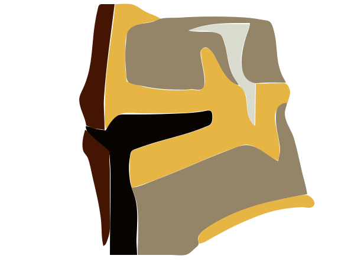

<h1 align="center">
    
    <br>
    dota-ihl-bot
</h1>

<p align="center">
    <a href="https://nodejs.org">
        
    </a>
    <a href="https://travis-ci.org/devilesk/dota-ihl-bot">
        
    </a>
    <a href="https://coveralls.io/github/devilesk/dota-ihl-bot">
        
    </a>
    <a href="https://david-dm.org/devilesk/dota-ihl-bot">
        
    </a>
    <a href="LICENSE">
        
    </a>
    <a href="https://discord.gg/gAkvEmF">
        
    </a>
</p>
<h4 align="center">A Discord bot for hosting Dota 2 inhouse leagues.</h4>
<p align="center">Need help? Check the <a href="https://github.com/devilesk/dota-ihl-bot/wiki">wiki</a>
or <a href="https://github.com/devilesk/dota-ihl-bot/issues/new">create an issue</a>.</p>

## Table of Contents
* [Features](#features)
* [Requirements](#requirements)
* [Getting Started](#getting-started)
* [Bot Commands](#bot-commands)
* [API Documentation](#api-documentation)
* [Tests](#tests)
* [Built With](#built-with)
* [Acknowledgements](#acknowledgements)
* [License](#license)

## Features

* Matchmaking Discord bot
* League settings customization
* Multiple lobby queue options
  * Player Draft - Automatically selected captains take turns picking teams
  * Autobalanced - Automatically created teams based on badge or inhouse Elo rating
  * Challenge - Players challenge each other to captain—followed by player draft
* Dota 2 lobby hosting
* Match stats tracking
  * Leaderboard
  * Inhouse Elo rating

## Requirements

Installation
* [Git](https://git-scm.com)
* [npm](http://npmjs.com)
* [svn](https://subversion.apache.org/) - Required to install [steam-resources](https://github.com/seishun/node-steam-resources), a dependency of [node-dota2](https://github.com/Arcana/node-dota2).

Runtime
* [Node.js](https://nodejs.org/en/download/) 10+ (Tested with 10.9.0)
* [PostgreSQL](https://www.postgresql.org/download/) 9.5+ (Tested with 9.5.14)

## Getting Started

Clone and install the `dota-ihl-bot` package.

```bash
# Clone this repository
$ git clone https://github.com/devilesk/dota-ihl-bot

# Go into the repository
$ cd dota-ihl-bot

# Install dependencies
$ npm install
```

`dota-ihl-bot` uses the [dotenv](https://github.com/motdotla/dotenv) module to load environment variables from a `.env` file, so you'll create one now.

```bash
# Create an empty .env configuration file
$ touch .env
```

Use the following template to fill in your `.env` file. Check the [wiki page](https://github.com/devilesk/dota-ihl-bot/wiki) for more details.

```bash
# Database name
DB_NAME=ihl
# Database user
DB_USERNAME=postgres
# Database password 
DB_PASSWORD=password
# Database connection string
DB_HOST=127.0.0.1
# Discord bot token
TOKEN=
# Discord bot command prefix
COMMAND_PREFIX=!
# Bot owner discord ID
OWNER_DISCORD_ID=
# How often to poll for completed match stats (in milliseconds)
MATCH_POLL_INTERVAL=5000
# Discord bot invite url
INVITE_URL=
# Discord bot client ID
CLIENT_ID=
# Discord bot client secret
CLIENT_SECRET=
# Discord bot OAuth2 callback url
CALLBACK_URL=
# Steam Web API key
STEAM_API_KEY=
# Log SQL statements
LOGGER_LOG_SQL=false
# Log output
LOGGER_SILENT=false
# Log level
LOGGER_LEVEL=debug
# Log exception file
LOGGER_EXCEPTIONLOGFILE=exceptions.log
# Log directory
LOGGER_DIRNAME=logs
# Log filename
LOGGER_FILENAME=application-%DATE%.log
# Log date pattern
LOGGER_DATEPATTERN=YYYY-MM-DD-HH
# Log zipped
LOGGER_ZIPPEDARCHIVE=true
# Max log file size
LOGGER_MAXSIZE=20m
# Log expiration
LOGGER_MAXFILES=14d
```

Create the Postgres database.

```bash
# Create PostgreSQL database and run migrations
$ npm run db:init
```

Now you're ready to start the bot.

```bash
# Run the bot
$ npm start
```

## Bot Commands

Links to README documentation in `commands/<group>` folders:
 
* [Owner](commands/owner/README.md)
* [Admin](commands/admin/README.md)
* [Inhouse](commands/ihl/README.md)
* [Queue](commands/queue/README.md)
* [Challenge](commands/challenge/README.md)

## API Documentation

[View the docs here.](https://devilesk.github.io/dota-ihl-bot/)

```bash
# Generate docs
$ npm run docs
```

## Tests

```bash
$ npm test
```

## Built With

Major dependencies:

- [discord.js](https://github.com/discordjs/discord.js/tree/stable) - Discord API library
- [Commando](https://github.com/discordjs/Commando/tree/djs-v11) - discord.js command framework
- [node-dota2](https://github.com/Arcana/node-dota2) - Dota 2 bot library
- [Sequelize](https://github.com/sequelize/sequelize) - SQL ORM
- [winston](https://github.com/winstonjs/winston) - Logging

Testing:

- [Mocha](https://github.com/mochajs/mocha)
- [Chai](https://github.com/chaijs/chai)
- [Sinon](https://github.com/sinonjs/sinon)
- [Nock](https://github.com/nock/nock)

## Acknowledgements

Thanks to the [Reddit Dota 2 League](https://rd2l.gg/) for support and testing!

## License
* [ISC License](https://opensource.org/licenses/ISC)
* Copyright 2019 © [devilesk](https://github.com/devilesk/)